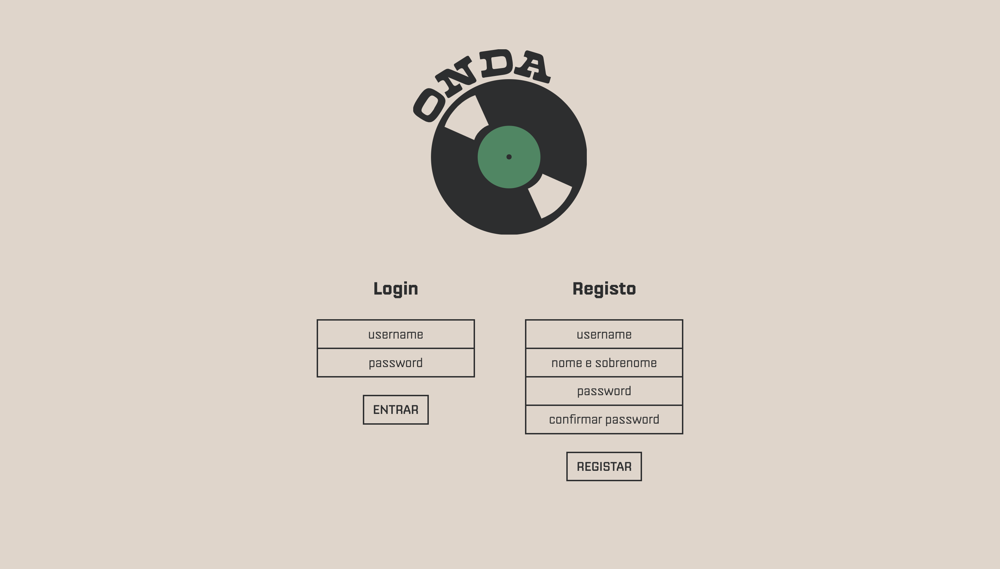
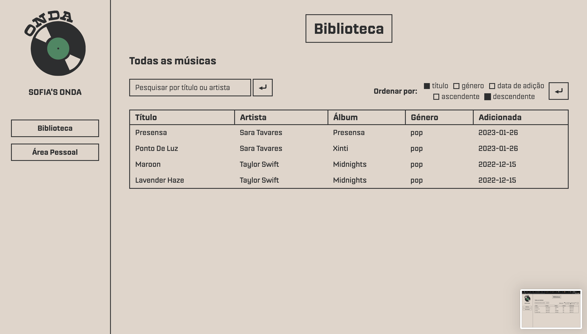
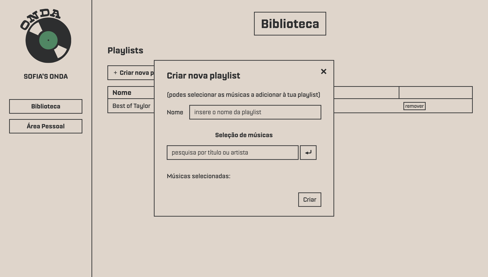
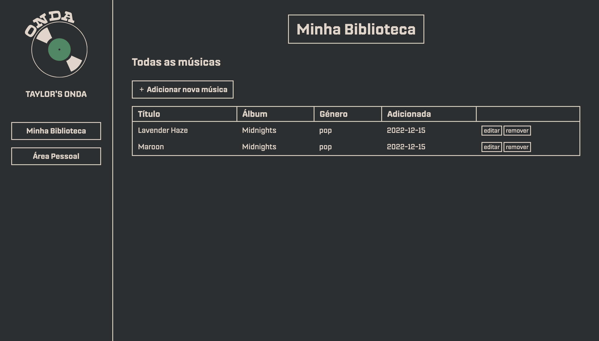
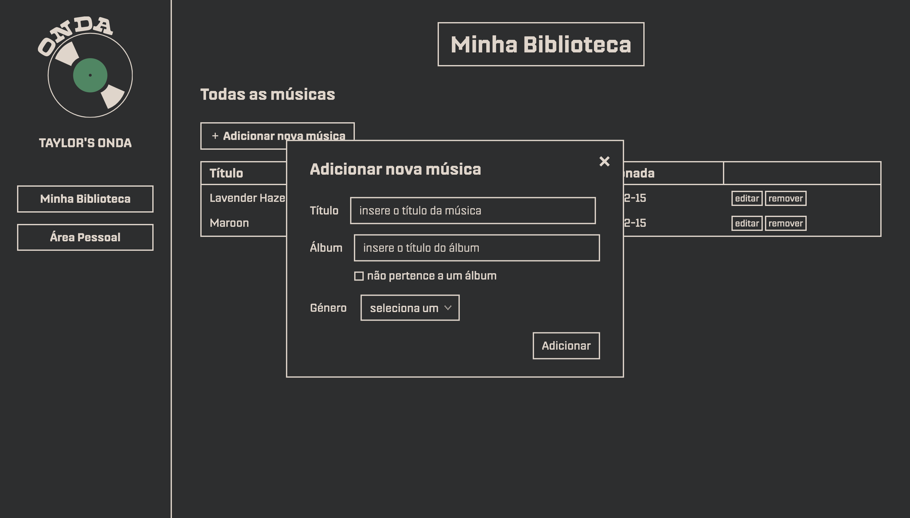

# ONDA

## Introduction
This project was developed during the Informatic Systems course (class of 2022/23) of the Multimedia Design Bachelor's in University of Coimbra. The main purpose was to create a dynamic website using PHP and a PostgreSQL database.

## Features
ONDA is a music streaming service that provides multiple features to both listeners and artists.

* As a listener, you'll be able to:
    * create an account
    * list all the available songs and sort by attribute
    * search songs by title or artist
    * create a playlist
        * randomly, by selecting the music genre and the number of songs
        * manually, by selecting each song
    * list and remove your playlists

* As an artist, you'll be able to: 
    * create an account
    * add a song (can be part of an album)
    * list, edit and remove songs

## Preview
*Homepage*

*Listener view*

 
 

*Artist view*

 

## Setup
1. Make sure [PHP](https://www.php.net/downloads.php) is installed on your machine.
2. Also, [PostgresSQL](https://www.postgresql.org/download/) must be running with ` user=postgres password=postgres host=localhost port=5432 ` 
3. Create local repo of the project: ` git clone https://github.com/scgsantos/ONDA.git `
4. Create PostgreSQL database named *ONDA*: ` createdb -U postgres ONDA `
5. Restore from the db dump file in local repo [(+ info)](https://www.postgresql.org/docs/current/backup-dump.html): ` psql -U postgres ONDA < ONDAdb.sql `
6. Go to local repo directory and run ` php -S localhost:<port> `
7. Go to [http://localhost:&lt;port&gt;/home.html](http://localhost:port/home.html")
